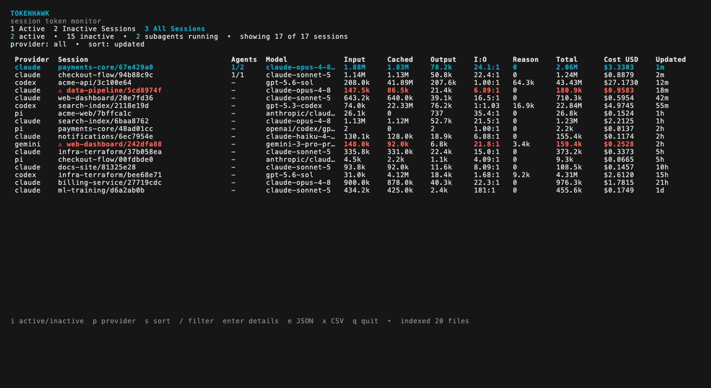
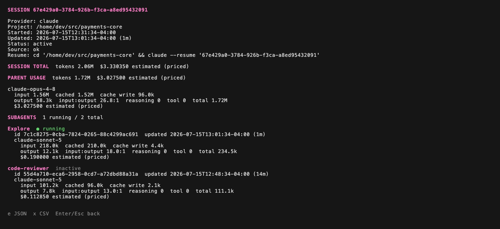
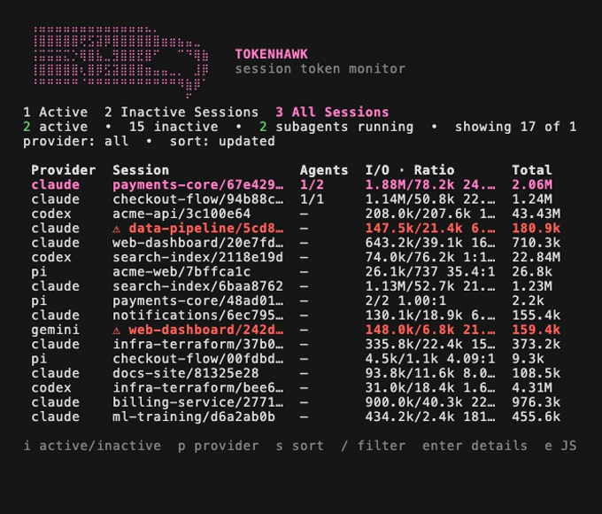

# Tokenhawk

Tokenhawk is a local, live token-usage monitor for Claude Code, Codex, Gemini CLI, Pi, and OpenCode. It indexes session metadata from the tools' normal home-directory stores and presents active sessions, history, per-model usage, spend since a chosen date, and cost estimates in a Bubble Tea terminal UI.

Tokenhawk never stores or exports prompts, responses, tool arguments, credentials, or transcript content.

The dashboard includes a responsive monochrome angular hawk-head wordmark that collapses to a single line in narrow terminals. Session rows include input, cached input, output, total, normalized input-to-output ratios, running/total subagents, and cost at medium and wide terminal sizes. Session detail breaks out Claude, Codex, and OpenCode subagents with their model, token categories, ratio, status, and cost.

Sessions with at least 100,000 input tokens and less than an 80% cached-input ratio are highlighted with a red warning in the dashboard. Detail identifies low-cache parent and subagent workloads separately.

## Screenshots

The dashboard lists sessions across every provider with per-model usage, API-equivalent and reported cost, normalized input-to-output ratios, running subagent counts, and red high-input, low-cache warnings.



Selecting a session opens a detail view that breaks out parent and subagent usage per model, marks running versus inactive subagents, and includes a copy-ready resume command.



The layout is responsive: narrow terminals collapse the table columns and the hawk-head wordmark to fit.



_Screenshots use synthetic demo data._

## Features

- Live, local monitoring of Claude Code, Codex, Gemini CLI, Pi, and OpenCode sessions
- Compact per-session status output for shell, JSON, ANSI, and tmux integrations
- Native Claude Code status-line integration and tmux-backed wrappers for every supported client
- Separate Active, Inactive Sessions, All Sessions, and Spend views
- Spend totals and input-to-output ratios since any relative or absolute date, broken out by provider, model, and day
- Per-session and per-model input, cached, output, reasoning, tool, and total tokens
- Parent/subagent accounting with running-agent counts and detailed child usage
- API-equivalent estimates and provider-reported costs with explicit status
- High-input, low-cache warnings at a documented threshold
- JSON and CSV export for the visible session set or one selected session
- Rebuildable SQLite index; provider transcript files remain untouched

## Install, build, and run

Install the latest compiled release on macOS or Linux:

```sh
/bin/sh -c "$(curl -fsSL https://tokenhawk.dev/install.sh)"
tokenhawk
```

The installer detects your operating system and architecture, verifies the release
checksum, and installs to `~/.local/bin`. Add that directory to your `PATH` if the
installed command is not found.

Alternatively, with Go 1.26 or newer, install the latest tagged release directly
from the module root:

```sh
go install github.com/polera/tokenhawk@latest
tokenhawk
```

Ensure `$(go env GOPATH)/bin` is on `PATH` if the installed command is not found.

Precompiled binaries for Linux, macOS, and Windows on amd64 and arm64 are also
available from [GitHub Releases](https://github.com/polera/tokenhawk/releases/latest).
Download the archive for your platform, extract `tokenhawk` (`tokenhawk.exe` on
Windows), and place it somewhere on your `PATH`. Each release includes
`checksums.txt` for verifying the download.

Tokenhawk checks GitHub Releases once a day when starting the interactive UI. If
a newer release is available, choose to install it or defer the prompt for 24
hours. To check and upgrade immediately, run:

```sh
tokenhawk upgrade
```

Upgrades download the release archive for the current operating system and
architecture, verify it against the published SHA-256 checksum, and replace the
current executable.

Or build a local checkout with Go 1.26 or newer:

```sh
go build -o tokenhawk .
./tokenhawk
```

Run it in a dedicated terminal tab or window. By default Tokenhawk reads:

- Claude: `~/.claude/projects/**/*.jsonl`
- Codex: `$CODEX_HOME/sessions/**/*.jsonl` and `archived_sessions`, or `~/.codex`
- Gemini: `~/.gemini/tmp/*/chats/session-*.json`
- Pi: `${PI_CODING_AGENT_SESSION_DIR:-~/.pi/agent/sessions}/**/*.jsonl`
- OpenCode: `${XDG_DATA_HOME:-~/.local/share}/opencode/opencode.db`

The rebuildable SQLite index lives under the operating system's user cache directory. OpenCode's database is opened read-only, including live WAL data. Missing provider directories and databases are allowed.

## Live metrics inside agent sessions

The compact renderer always selects one session; it never combines usage from multiple sessions. Claude provides an exact session ID. The wrappers for other clients select the active, most recently updated session belonging to the current project directory.

Example output:

```text
TOKENHAWK  codex · in 11.80M · cache 96.6% · out 76.4k · I:O 154:1 · $4.2800 · 2/4 agents
```

At 100,000 or more input tokens, a cache ratio below 80% changes the status display to the red `LOW CACHE` alarm. Use the renderer directly when integrating with another terminal tool:

```sh
tokenhawk status --provider codex --project "$PWD"
tokenhawk status --provider claude --session SESSION_ID --format json
tokenhawk status --provider gemini --project "$PWD" --format ansi
```

By default the command incrementally scans the provider stores before rendering. Add `--no-scan` when another Tokenhawk process is already maintaining the index. Set `NO_COLOR=1` to turn ANSI status-line output into plain text.

### Claude Code: native status line

[Claude Code's status-line command](https://code.claude.com/docs/en/statusline) can run Tokenhawk directly and supplies the exact `session_id`. Add this to `~/.claude/settings.json`, merging it with any existing settings:

```json
{
  "statusLine": {
    "type": "command",
    "command": "tokenhawk statusline claude",
    "refreshInterval": 2,
    "padding": 0
  }
}
```

The line refreshes on Claude events and every two seconds while the session is idle. The command consumes Claude's status JSON from stdin; it does not add anything to the model context. Claude can also use the universal wrapper below with `tokenhawk wrap claude`.

### Codex: live tmux status bar

[Codex's configurable footer](https://developers.openai.com/codex/config-reference/) accepts built-in item identifiers, not external command output. Run Codex through Tokenhawk to add a live project-session status row:

```sh
tokenhawk wrap codex
tokenhawk wrap codex --cd /path/to/project
tokenhawk wrap codex resume SESSION_ID
```

### Gemini CLI: live tmux status bar

[Gemini's footer](https://github.com/google-gemini/gemini-cli/blob/main/docs/reference/configuration.md) likewise exposes built-in items rather than an external renderer:

```sh
tokenhawk wrap gemini
tokenhawk wrap gemini --model gemini-2.5-pro
tokenhawk wrap gemini --resume SESSION_ID
```

### Pi: live tmux status bar

[Pi records](https://pi.dev/docs/latest/session-format) provider/model token categories and its own calculated cost in each JSONL session; Tokenhawk preserves that reported cost rather than repricing it:

```sh
tokenhawk wrap pi
tokenhawk wrap pi --model anthropic/claude-sonnet-4-5
tokenhawk wrap pi --session SESSION_ID
```

Tokenhawk respects `PI_CODING_AGENT_DIR` and `PI_CODING_AGENT_SESSION_DIR` when discovering sessions.

### OpenCode: live tmux status bar

Tokenhawk reads current OpenCode session, message, child-session, token, cache, reasoning, and reported-cost data from its SQLite database. OpenCode documents the database location through [`opencode db path`](https://dev.opencode.ai/docs/cli/):

```sh
tokenhawk wrap opencode
tokenhawk wrap opencode /path/to/project
tokenhawk wrap opencode --session SESSION_ID
```

`tokenhawk wrap` requires `tmux`. Outside tmux it creates a dedicated temporary session with Tokenhawk's colors. Inside tmux it temporarily replaces the current session's right-side status, runs the client, and restores the previous settings when the client exits. All remaining arguments are forwarded unchanged to the selected client.

## Controls

| Key | Action |
| --- | --- |
| `1`, `2`, `3` | Active sessions, inactive sessions, all sessions |
| `4` | Spend since a date |
| `i` | Toggle between active and inactive session lists |
| `j`/`k`, arrows, page keys | Navigate |
| `p` | Cycle provider filter |
| `s` | Sort by updated time, tokens, or cost |
| `/` | Filter by project or model metadata |
| `t` | Cycle the spend window (spend view) |
| `d` | Type a spend window (spend view) |
| `enter` | Session detail, including a provider-specific resume command |
| `e` / `x` | Export the visible set as JSON / CSV |
| `q` | Quit |

## Spend since a date

Press `4` for tokens and cost across a window instead of per session. The view totals input, cached input, output, and cost for the window, then breaks the same window out by provider, by model, and by day:

```text
SPEND · last 7 days
2026-07-13 09:41 → now  •  23 of 25 sessions  •  counted by last session update

TOTAL  tokens 17.30M  in 16.71M  cached 15.99M (96%)  out 238.3k  i:o 70.1:1
       $20.184584 estimated (priced)

BY PROVIDER
  codex  ████████████    12 sess  tokens 10.25M  in 10.14M  cached 9.42M  out 117.5k  i:o 86.3:1  $11.8310
  claude ████████····    11 sess  tokens  7.04M  in  6.57M  cached 6.57M  out 120.8k  i:o 54.4:1  $8.3536
```

`t` cycles the built-in windows: last 24 hours, 7 days, 30 days, month to date, and all time. `d` accepts a typed window, and `--since` opens Tokenhawk directly on one:

```sh
tokenhawk --since 30d
tokenhawk --since 2026-07-01
```

Windows accept RFC 3339 timestamps, `YYYY-MM-DD` dates, relative offsets (`90m`, `24h`, `7d`, `2w`, `3mo`, `1y`, or any Go duration), and the keywords `today`, `yesterday`, `wtd`, `mtd`, `ytd`, and `all`. Relative windows keep rolling while Tokenhawk stays open. The provider filter and the `/` search narrow the spend view too, and `e` and `x` export exactly the sessions the window covers.

Provider stores record one running total per session rather than a timestamped ledger, so a session's whole usage is counted on the day it was last updated. Sessions that span days or that resume after the window opens are therefore attributed to that single day, which the view states rather than implying a per-day ledger it cannot derive.

## Headless export

```sh
tokenhawk export --format json --output usage.json
tokenhawk export --format csv --output usage.csv --provider codex --since 2026-07-01
tokenhawk export --format csv --output usage.csv --since mtd
```

Filters include `--provider`, `--model`, `--project`, `--status`, `--since`, and `--until`. Both dates accept every window form the spend view accepts; a bare `YYYY-MM-DD` in `--until` includes that whole day. JSON contains nested per-model and subagent usage. CSV contains tagged session/model and subagent/model rows, including costs and running status. Source paths are excluded unless `--include-source` is set.

## Configuration

Tokenhawk loads `tokenhawk/config.toml` below the OS user-config directory. All fields are optional:

```toml
claude_dir = "~/.claude/projects"
codex_dir = "~/.codex"
gemini_dir = "~/.gemini/tmp"
pi_dir = "~/.pi/agent/sessions"
opencode_db = "~/.local/share/opencode/opencode.db"
active_window = "5m"
refresh = "2s"
db_path = "~/.cache/tokenhawk/index.db"
pricing_file = "~/.config/tokenhawk/pricing.json"
include_source = false
```

Equivalent CLI flags override the loaded values. Use `--rebuild` after changing source roots. Pricing catalog and override changes are fingerprinted and automatically trigger a one-time rebuild so stored estimates cannot remain stale.

## Pricing

Claude, Codex, and Gemini costs are explicitly estimates of public API list-price equivalents, not subscription charges, invoices, free-tier consumption, discounts, or taxes. The bundled, effective-dated catalog only prices exact known model IDs. Unknown identifiers remain marked `unpriced` rather than inheriting a guessed family rate. Pi and OpenCode already record calculated costs; Tokenhawk labels those values `reported` and preserves them instead of applying a second price calculation.

Session detail includes a copy-ready resume command. Tokenhawk changes to the recorded project directory first because resume behavior can be project-sensitive.

A pricing override file can add exact identifiers or replace a bundled rate:

```json
{
  "version": "company-rates-1",
  "rates": [
    {
      "provider": "codex",
      "model": "my-exact-model-id",
      "effective_from": "2026-01-01",
      "input_per_million": 1.0,
      "cached_input_per_million": 0.1,
      "cache_creation_per_million": 1.0,
      "output_per_million": 8.0
    }
  ]
}
```
